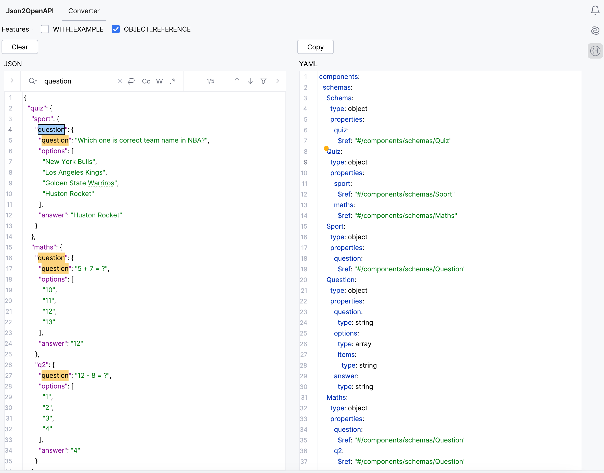

# Json2OpenAPI

<!-- Plugin description -->
This plugin provides a useful feature for converting JSON objects into OpenAPI YAML schema files directly within your favorite IDE.

The plugin offers the following optional conversion options:

- Inclusion of example values from the original JSON object in the generated YAML schema
- Detection of structured duplicate JSON objects and reference to OpenAPI schemas

<!-- Plugin description end -->

